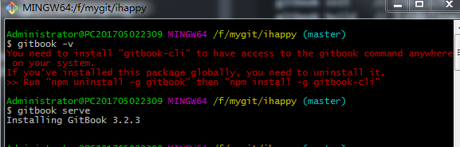

### 命令

`cnpm i -g gitbook-cli`
```
 gitbook init    // 初始化目录
 gitbook build   // 生成静态html
 gitbook serve   // 生成静态文件并启动服务器
```

> 先安装脚手架 然后gitbook serve的时候会自动安装gitbook 3.2.3  安装会慢一点



> docsify  gitbook build 折叠