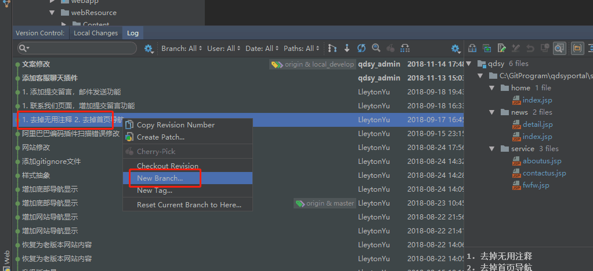

20181115
##### 场景描述0
>新需求来了要基于现有版本，做一个定制版本，那么git如何拉取分支
 记得创建后，提交，推送，开发分支，后端仓库分支，如何打包?

##### 场景描述1
>git commit提交错了分支，撤销commit  和 遴选 commit
commit 推送前和推送后

##### 场景描述2 
>之前做过一个海康定制版本，基于2.0.4的，现在客户要升级到2.0.5，
那么git如何操作

answer: 变基
[官网git变基](https://git-scm.com/book/zh/v1/Git-%E5%88%86%E6%94%AF-%E5%88%86%E6%94%AF%E7%9A%84%E5%8F%98%E5%9F%BA)  

##### 场景描述3
>a分支提交了10个commit，，我想在第5个commit的地方拉一个新分支，git可以操作吗？如何操作？

answer：
* checkout 加commit版本号  
  就checkout -b 新分支名 -版本号试试  
  还有就是checkout一个新分支，你再reset到指定版本也可以
* git checkout -b [NewBranch] [commit值]
* 选中某一个commit，然后创建分支就可以了

* git checkout [revision] .  
[Rollback to an old Git commit in a public repo- stackoverflow](https://stackoverflow.com/questions/2007662/rollback-to-an-old-git-commit-in-a-public-repo )

* [git checkout简介-CSDN](https://blog.csdn.net/hudashi/article/details/7664482)

