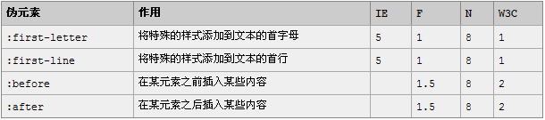
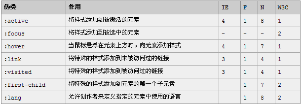

[sg 2017-11-25 发布
谈谈css伪类与伪元素](https://segmentfault.com/a/1190000012156828)
> CSS3 规范中，单冒号(:)用于 CSS3 伪类，双冒号(::)用于 CSS3 伪元素  
>  CSS2 中已经有的伪元素，例如 :before，单冒号和双冒号的写法 ::before 作用是一样的。  
> 如果你的网站只需要兼容 webkit、firefox、opera 等浏览器，建议对于伪元素采用双冒号的写法，如果不得不兼容 IE 浏览器，还是用 CSS2 的单冒号写法比较安全
