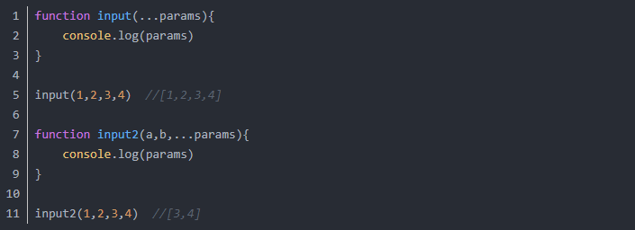
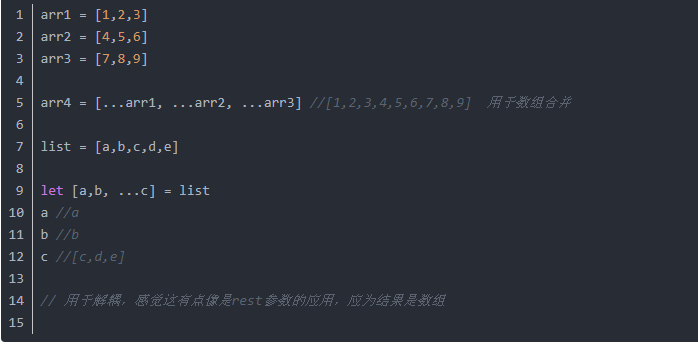

[csdn 博文](https://blog.csdn.net/u010603896/article/details/76681842)  

翻看ES6代码，很多时候都会看到三个点(...)的存在,它在ES6语法中，有两种应用形式，分别为函数中的rest参数，以及扩展运算符

##### REST参数
rest参数和一个变量名搭配使用，生成一个数组，用于获取函数多余的参数，说不清楚，还是代码实例演示

rest参数作用： 
将多余的逗号分隔的参数序列转换为数组参数
注意： rest参数必须是最后一个参数，否则报错

##### 扩展运算符
扩展运算符可以理解为rest参数的逆运算，将数组转换为逗号分隔的参数序列，应用如下
