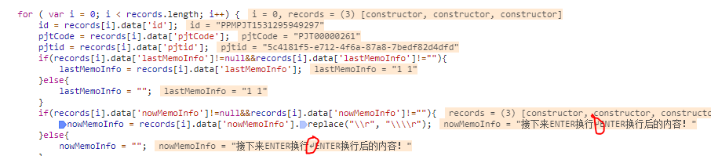

--------------------------------------------


[link2](https://ask.csdn.net/questions/694446)  

q：
EXTJS textarea内容有按回车键换行，之后无法提交文本域的值到后台
我用谷歌前端debugger时发现数值中多了个符号如图
a：
 那个是\n回车符号啊。。ie下回车由\r\n组成，非ie是\n，要统一你应该替换掉\r，将r变为n。而且replace只替换一次，多个要用正则

 xxxx.replace(/\r/g,'').replace(/\n/g,'\\\\n')


--------------------------------------------
[link1](https://blog.csdn.net/hj7jay/article/details/74279967)


问题：

获取到textarea标签内的格式（换行符、空格）取到，存入数据库，展示的时候能够保留基本格式。


解决思路：

IE9以上、FF、chrome的换行为\n， IE7-8的时候换行为\r\n，空格都为\s

所以需要利用replace把不同浏览器的\n和\r\n都替换为html代码的</br>，把\s空格替换为html的&nbsp 

注：如果使用jQuery的val()获取textarea的值，取得的值是不含有回车（\r）字符的。但是如果该值是通过 XHR 传递给服务器的，回车（\r）字符会被保留（或者是被浏览器添加的，但是在原始数据中并不包含回车（\r））。

该例对\r和\r\n都做了replace替换，实际效果不受影响，只需要注意一下有区别。
————————————————

```html
<textarea name="" id="text" cols="30" rows="3"></textarea>
<input type="button" id="btn" value="测试测试" />
<div id="show"></div>
```

```js
document.getElementById("btn").onclick = function() {
		var strContent = document.getElementById("text").value;
		alert("处理前的strContent为\r\n"+strContent);
		strContent = strContent.replace(/\r\n/g, '<br/>'); //IE9、FF、chrome
		strContent = strContent.replace(/\n/g, '<br/>'); //IE7-8
		strContent = strContent.replace(/\s/g, ' '); //空格处理
		alert("转换之后的html代码为\r\n"+strContent);
		document.getElementById("show").innerHTML = strContent;
	};

```
写一个公共函数处理该类问题。  
调用getFormatCode即可得到拿到转换后的代码，随后可按需求自行处理（入库等）。
```JS

/*
 * 根据Value格式化为带有换行、空格格式的HTML代码
 * @param strValue {String} 需要转换的值
 * @return  {String}转换后的HTML代码
 * @example  
 * getFormatCode("测\r\n\s试")  =>  “测<br/> 试”
 */
var getFormatCode=function(strValue){
	return strValue.replace(/\r\n/g, '<br/>').replace(/\n/g, '<br/>').replace(/\s/g, ' ');
}
```