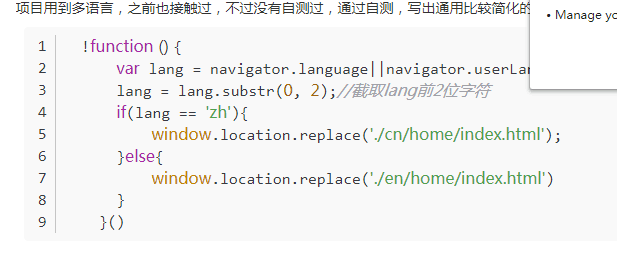

因为语言都是两部分 
前一部分 是语言，后一部分是 国家

其他浏览器特有
navigator.language
navigator.languages

ie特有
navigator.userLanguage
navigator.systemLanguage
navigator.browserLanguage



[sg navigator.language 代表的是浏览器的语言？](https://segmentfault.com/q/1010000002468965)


[博客园 language介绍](https://www.cnblogs.com/Garven/articles/6954238.html)

```
var language = (navigator.browserLanguage || navigator.language).toLowerCase();
if(language.indexOf('zh')>-1){
    alert('中文');
}else if(language.indexOf('en')>-1){
    alert('英文')
}else{
    alert('其他语言')
}
```