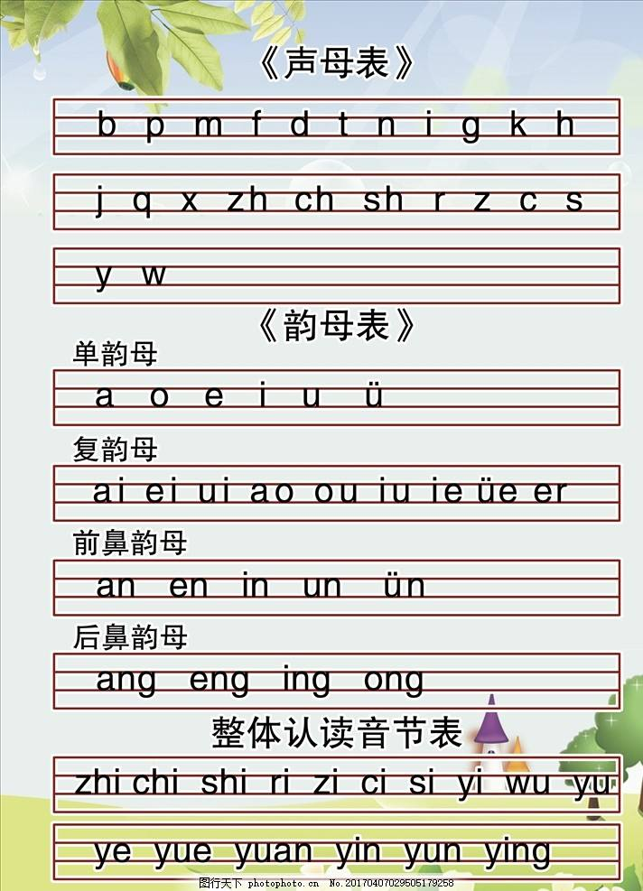

### ASCII码

```
00001010	10	0A	LF (NL line feed, new line)	换行键

00001101	13	0D	CR (carriage return)	回车键

00001100	12	0C	FF (NP form feed, new page)	换页键
```
[ASCII码表(0-127 ) C中的转义字符](https://www.cnblogs.com/pjl1119/p/8405938.html)

---
### 常用数学符号读法大全 希腊字母

```
大写	小写	英文注音	国际音标注音	中文注音
Α	α	alpha	alfa	阿耳法
Β	β	beta	beta	贝塔
Γ	γ	gamma	gamma	伽马
Δ	δ	deta	delta	德耳塔
Ε	ε	epsilon	epsilon	艾普西隆
Ζ	ζ	zeta	zeta	截塔
Η	η	eta	eta	艾塔
Θ	θ	theta	θita	西塔
Ι	ι	iota	iota	约塔
Κ	κ	kappa	kappa	卡帕
∧	λ	lambda	lambda	兰姆达
Μ	μ	mu	miu	缪
Ν	ν	nu	niu	纽
Ξ	ξ	xi	ksi	可塞
Ο	ο	omicron	omikron	奥密可戎
∏	π	pi	pai	派
Ρ	ρ	rho	rou	柔
∑	σ	sigma	sigma	西格马
Τ	τ	tau	tau	套
Υ	υ	upsilon	jupsilon	衣普西隆
Φ	φ	phi	fai	斐
Χ	χ	chi	khai	喜
Ψ	ψ	psi	psai	普西
Ω	ω	omega	omiga	欧米伽
```
[参考link](http://www.fhdq.net/sx/14.html)  

---
### 声母韵母

